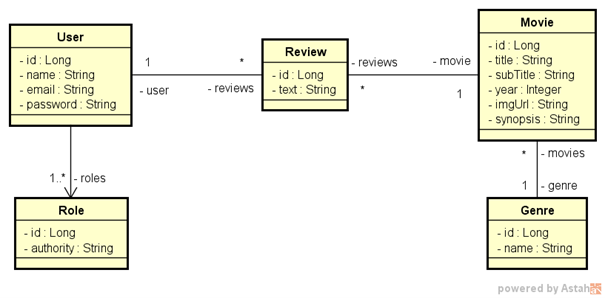

# Movieflix (back end)

Movieflix is a movie database with reviews made by users.
Each user can be a VISITOR or a MEMBER; only members can insert reviews.

**Technologies:** Java 11, Spring Boot 2.4.x and MockMvc

_Project made along "DevSuperior Bootcamp 2021" by professor Dr. Nélio Alves_

## Entities diagram


## Front end (Figma)
<https://www.figma.com/file/qmduL2GXrMrqRLyFjFCk56/MovieFlix-web>

## Endpoints

### ``GET /movies/{id}``

```json
{
    "id": 1,
    "title": "movie title",
    "subTitle": "movie sub title",
    "year": 2020,
    "imgUrl": "https://image.link/xxx.jpg",
    "synopsis": "Synopsis long text",
    "genre": {
        "id": 1,
        "name": "Comedy"
    }
}
```

### ``GET /movies/?genreId=N``

```json
{
    "content": [
        {
            "id": 2,
            "title": "O Orfanato",
            "subTitle": null,
            "year": 2007,
            "imgUrl": "https://image.tmdb.org/t/p/w533_and_h300_bestv2/2AlVaQDH67RgulE2AqXBSPr2POF.jpg"
        },
        {
            "id": 10,
            "title": "O Segredo da Cabana",
            "subTitle": null,
            "year": 2012,
            "imgUrl": "https://image.tmdb.org/t/p/w533_and_h300_bestv2/5iiVfPS6LsAqmVQVOzhyCHhCFgU.jpg"
        },
        {
            "id": 9,
            "title": "Uma Noite de Crime",
            "subTitle": "Anarquia",
            "year": 2014,
            "imgUrl": "https://image.tmdb.org/t/p/w500_and_h282_face/ecD9hT8odHzFCDeGDy4N2IKh0LN.jpg"
        }
    ],
    "pageable": {
        "sort": {
            "sorted": true,
            "unsorted": false,
            "empty": false
        },
        "offset": 0,
        "pageSize": 20,
        "pageNumber": 0,
        "unpaged": false,
        "paged": true
    },
    "last": true,
    "totalPages": 1,
    "totalElements": 3,
    "size": 20,
    "number": 0,
    "sort": {
        "sorted": true,
        "unsorted": false,
        "empty": false
    },
    "first": true,
    "numberOfElements": 3,
    "empty": false
}
```

### ``GET /genres``

```json
[
    {
        "id": 1,
        "name": "Comedy"
    },
    {
        "id": 3,
        "name": "Drama"
    }
]
```

### ``POST /reviews``

```json
{
    "text" : "review text",
    "movieId" : 1
}
```
